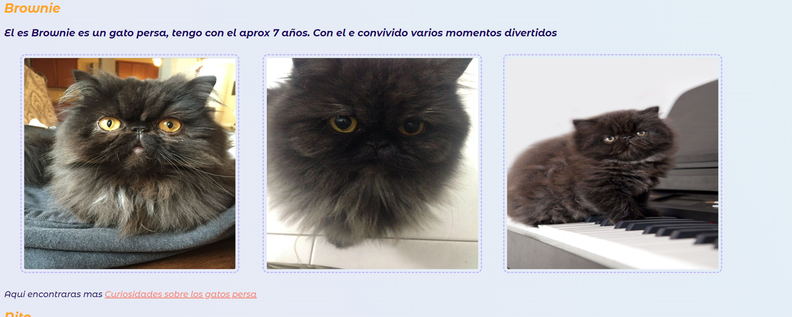

# Catdoggy
Es una página diseñada por mi con el proposito de enseñar y mostrar los conceptos basicos que aprendi en el curso

### Tecnologías Utilizadas
+ *HTML5:* Para la estructura básica del sitio.
+ *CSS3:* Para el diseño y el estilo, incluyendo flexbox para un diseño responsivo y efectos de hover.
+ *Google Fonts:* Para fuentes personalizadas.

### Vista Previa del Proyecto

### Contacto
Si te gustaría invitarme a colaborar en un proyecto, escríbeme por [LinkedIn](https://www.linkedin.com/in/lesly-gabriela-quiroz-bueno-b0b346183)
